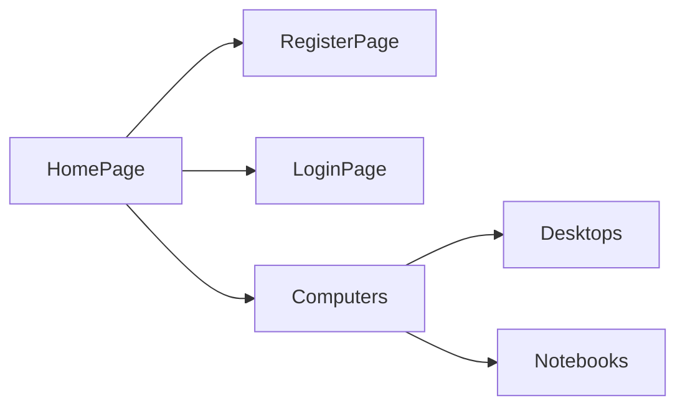
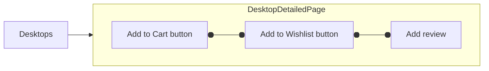

# Build Framework with NopCommerce
NopCommerce is open-source Ecommerce platform, including [Frontend](https://demo.nopcommerce.com/) area and [Admin](https://admin-demo.nopcommerce.com/login) area. 

These areas are not interconnected. 

The site is reset to its original state every hour.

The waiting time is 30 seconds after the 1st order is made.

## Framework Structure:

Apply `Page Object Model (POM)` with 4 main layers:

 1. testcases: contains modules of project, one module is one package. It also contains common testcase (for example, register account) to avoid creating too many accounts for each class. 
 2. actions: contains some specific packages
    - commons package: common functions for pages and testcases, constructors management and global constants.
    - pagesObject package: functions for each page.
    - reportsConfig package: reports configuration
    - utilities package: utilities such as: datafaker, ...
 3. interfaces: contains page UIs of each module.
 4. resources: files management, data test, environment files of project.

<pre>
├── <b>testcases</b>
  ├── admin
    ├── Admin_01_SearchWithProduct.java
  ├── user
    ├── User_01_LoginAccount.java
    ├── ...
  ├── common
    ├── Common_RegisterAccount.java
├── <b>actions</b>
  ├── commons
    ├── BasePage.java (used by pagesObject)
    ├── BaseTest.java (used by testcases)
    ├── PageGeneratorManagementUser.java (contains all User Pages construtors)
    ├── PageGeneratorManagementAdmin.java (contains all Admin Pages constructors)
    ├── GlobalConstants.java
  ├── pageObjects.user
    ├── LoginPageObject.java
    ├── HomePagePageObject.java
    ├── ...
  ├── pageObjects.admin
    ├── DashboardPageObject.java
    ├── ProductsPageObject.java
    ├── ...
  ├── reportsConfig
    ├── AllureTestListener.java
    ├──...
  ├── utilities
    ├── DataHelper.java
├── <b>interfaces</b>
  ├── user
    ├── LoginPageUI.java
    ├── HomePageUI.java
    ├── ...
  ├── admin
    ├── SearchPageUI.java
    ├── ...
├── <b>resources</b>
  ├── runNopCommerce.xml
  ├── environment.properties
  ├── ...
</pre>

## Tools & Libraries:
- Java 21
- Eclipse
- TestNG 6.14.3
- Selenium Server 4.14.0
- WebDriverManager 5.5.3
- Allure 2.24.0
- JavaFaker 1.0.2
- And some other dependency jar files in folder with `lib` prefix
## Some Working Flows of Site

## Report Results:
- Overview:
  

- Detailed TC & steps for each TC:
  

- Statistics:

